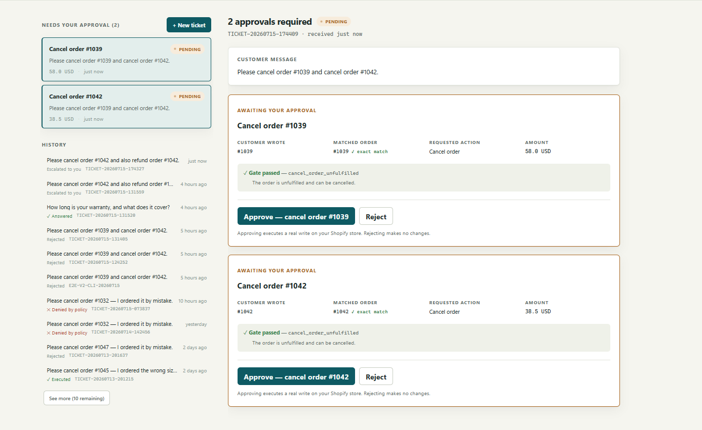
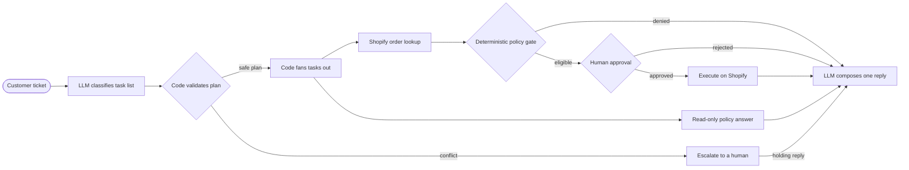

# storekeeper

An open-source AI customer-support agent for Shopify. A customer writes
"please cancel my order"  storekeeper reads the ticket, checks the request
against your store's rules, queues the cancellation for your one-click
approval, and drafts the reply. Under the hood, LLMs understand requests and
write replies, while deterministic code and human approval control every
sensitive order action.



*One customer message, two guarded actions: each Shopify write pauses on its
own approval card until a human decides.*

> **Project status:** Early v2 in active development. The CLI, localhost API,
> and React operator console have full ticket-workflow parity. FastAPI can serve
> the built console and API from one local process. It is designed for
> development stores and is not production-ready yet.

## Why storekeeper

Giving an LLM direct write access to a store is risky. A misunderstood request
or hallucinated tool call could become a real cancellation or refund.

storekeeper separates language tasks from business controls:

| The LLM handles | Deterministic code handles |
|---|---|
| Classifying the customer's intent | Mapping the intent to a supported action |
| Answering policy questions | Evaluating cancellation and refund rules |
| Drafting the customer reply | Controlling graph routing and approval |
| Extracting structured information | Executing only approved Shopify actions |

The policy gate is plain Python and does not depend on prompts, LangChain, or
LangGraph. Ticket text can influence what the customer is asking for, but it
cannot rewrite the store's policy rules or bypass the human approval step.

## How it works



The classifier's ordered task list is the v2 plan. Deterministic code validates
it and uses LangGraph `Send` to run independent tasks in parallel. Eligible
write actions each pause at their own interrupt, while read-only questions can
finish immediately. SQLite checkpoints allow every approval to be decided by
id from a later process. One composer merges the ordered results into one reply.

### See it in a trace

With LangSmith tracing enabled, every run shows the separation directly: one
model call for classification, a policy gate with no model inside it, and a
run tree that ends at the approval interrupt — no write node exists until a
human approves.


The full walkthrough is in [docs/langsmith.md](docs/langsmith.md).

## Try it with a free Shopify development store

You do not need a paid Shopify plan or a production store to explore
storekeeper. Shopify developers can create a
[free development store](https://shopify.dev/docs/apps/build/dev-dashboard/stores/development-stores),
install a custom app, create test orders, and run the workflow against realistic
Shopify data.

A development store is intended for building and testing. It cannot process
real transactions, and some Shopify features are limited. You need a Shopify
Partner account or the required developer permissions to create one.

This repository includes a resumable seed script that can create 50 test orders
covering normal, fulfilled, old, and high-value policy cases.

## Current capabilities

- Classifies one or more requests from a customer ticket into typed tasks.
- Fans independent tasks out in parallel and restores results to ticket order.
- Looks up real orders through the Shopify GraphQL Admin API.
- Applies deterministic cancellation, refund, and address-change policy rules.
- Requires human approval before every ticket-pipeline order write.
- Persists any number of pending approvals in SQLite so they survive restarts.
- Registers ticket ids separately and refuses accidental reuse of an existing id.
- Exposes the ticket workflow through a localhost FastAPI operator API.
- Creates, lists, reviews, approves, and rejects tickets in a local React console.
- Executes approved cancellations, full refunds, and shipping-address changes
  on Shopify.
- Answers policy questions from the store's markdown policy documents.
- Keeps only citations that refer to policy documents actually provided.
- Drafts one customer reply from all structured task results, including holding
  replies for work that needs a person.

## Quickstart

The commands below run the same in PowerShell and in a POSIX shell;
platform-specific variants are shown where they differ.

### Requirements

- Python 3.11+
- Node.js 20.19+ on the 20.x line, or Node.js 22.12+
- [uv](https://docs.astral.sh/uv/)
- A Shopify development store you own
- A custom Shopify app configured for client-credentials authentication
- An [OpenRouter](https://openrouter.ai/) API key for classification, policy
  answers, and reply drafting
- Optional: a [LangSmith](https://smith.langchain.com/) API key for tracing

### Install and configure

```sh
uv sync
cp .env.example .env
```

Add your Shopify and OpenRouter credentials to `.env`, then verify the store
connection:

```sh
uv run python scripts/smoke_shopify.py
```

### Run the offline checks

The unit suite makes no Shopify or model API calls:

```sh
uv run python -m unittest discover -s tests -v
uv run python -m compileall -q src scripts tests
```

### Prepare test orders

Always preview the seed plan first:

```sh
uv run python scripts/seed_store.py --plan
```

> **Warning:** The command below creates real test orders in the connected
> Shopify store. Use a development store, not a production store.

```sh
uv run python scripts/seed_store.py
```

### Run a ticket

Build the local policy index before running policy-question tickets. Re-run
this command after editing any file in `policies/`:

```sh
uv run python scripts/index_policies.py
uv run python scripts/search_policy.py "How long is your warranty?"
```

Use a unique ticket ID for each new ticket:

```sh
uv run python scripts/run_ticket.py TICKET-1001 "Please cancel order #1001."
uv run python scripts/run_ticket.py TICKET-1002 "Change order #1002 to 20 Lake Road, Dhaka, Dhaka 1205, Bangladesh."
```

Once a ticket ID has been registered or checkpointed, it cannot start another
ticket. Keep the same ID only when resuming its pending approval.

If actions pass the policy gate, the graph prints every pending approval and
its interrupt id. Resume one card at a time from the same or a later process:

```sh
uv run python scripts/run_ticket.py TICKET-1001 --approve INTERRUPT_ID
# or
uv run python scripts/run_ticket.py TICKET-1001 --reject INTERRUPT_ID
```

> **Warning:** Approving an eligible cancellation, refund, or address change executes a real
> write against the connected Shopify store. Review the displayed order,
> action, policy result, flags, and any address change before approving.

You can also exercise individual parts of the pipeline:

```sh
uv run python scripts/classify_ticket.py "Where is my order #1005?"
uv run python scripts/check_order_policy.py '#1001' cancel_order
```

### Run the operator console

Install the frontend dependencies once:

```sh
cd frontend
npm install
cd ..
```

Start FastAPI from the repository root:

```sh
uv run uvicorn storekeeper.api.app:app --host 127.0.0.1 --port 8000
```

In a second PowerShell terminal, start Vite:

```sh
cd frontend
npm run dev
```

Open `http://127.0.0.1:5173`.

#### Run from one process

Build the frontend:

```sh
cd frontend
npm run build
cd ..
```

Then start FastAPI from the repository root:

```sh
uv run uvicorn storekeeper.api.app:app --host 127.0.0.1 --port 8000
```

Open `http://127.0.0.1:8000`. FastAPI serves `frontend/dist` at `/` and keeps
the ticket API under `/api/`. If the build directory is absent, the API still
starts, but `/` returns 404 until the frontend is built.

The console can create tickets, browse history, display outcomes, reply drafts,
and verified citations, and review pending Shopify actions. Approval cards show
the customer reference next to the resolved order, the gate reason and flags,
and current versus proposed addresses before an operator approves or rejects.

> **Warning:** Approving a pending action in the console immediately resumes
> the graph and can execute a real cancellation, refund, or address change on
> the connected Shopify store.

You can also create and list tickets directly through the API. PowerShell:

```powershell
$ticketBody = @{ticket_text = "How long is your warranty?"} | ConvertTo-Json -Compress
$ticketBody | curl.exe -s -X POST localhost:8000/api/tickets -H "Content-Type: application/json" --data-binary '@-'
curl.exe -s localhost:8000/api/tickets
```

macOS/Linux:

```sh
curl -s -X POST localhost:8000/api/tickets -H "Content-Type: application/json" -d '{"ticket_text": "How long is your warranty?"}'
curl -s localhost:8000/api/tickets
```

## Current limitations

- It is currently designed for one operator working with a development store.
- Tickets are entered manually in the console or CLI. Email and helpdesk
  integrations (Zendesk, Gorgias) are planned for a future version.
- Every reply is a draft for the operator. storekeeper never sends messages
  to customers.
- The localhost console has no authentication and must not be exposed publicly.
- Address changes require the complete new street, city, state or province,
  postal code, and country. Incomplete requests escalate to a human.
- Same-order write combinations escalate instead of running concurrently.
- Plans cannot yet express dependencies, conditions, or replanning from looked-up facts.
- Missing order information produces a holding reply but does not yet ask the
  customer a structured clarifying question.
- OpenRouter-backed commands make paid model calls.
- LangSmith tracing is optional and can send trace data to an external service
  when enabled.
- The project is an early learning and development build, not a production
  support system.

## Project structure

```text
src/storekeeper/
├── api/            # FastAPI operator API and built-console serving
├── graph/          # LangGraph state, nodes, routing, and assembly
├── policy/         # Deterministic business rules
├── shopify/        # Shopify client, reads, and approved writes
├── classify.py     # Structured ticket classification
├── domain.py       # Shared business contracts
├── policy_docs.py  # Policy-document loading and retrieval seam
└── tickets.py      # Ticket registry and checkpoint-derived status

policies/           # Store policy documents
scripts/            # CLI workflows and development-store seeding
tests/              # Offline unit tests
frontend/           # Vite + React operator console
```

## Documentation

- [Vision](docs/VISION.md): the project's purpose and engineering thesis
- [Technical specification](docs/tech_spec.md): the system as currently built
- [Progress](docs/PROGRESS.md): roadmap and development history
- [LangSmith walkthrough](docs/langsmith.md): reading a run trace
- [Testing](docs/testing.md): verification and live-check workflow
- [Troubleshooting](docs/TROUBLESHOOTING.md): problems encountered and fixes

## License

[MIT](LICENSE)
