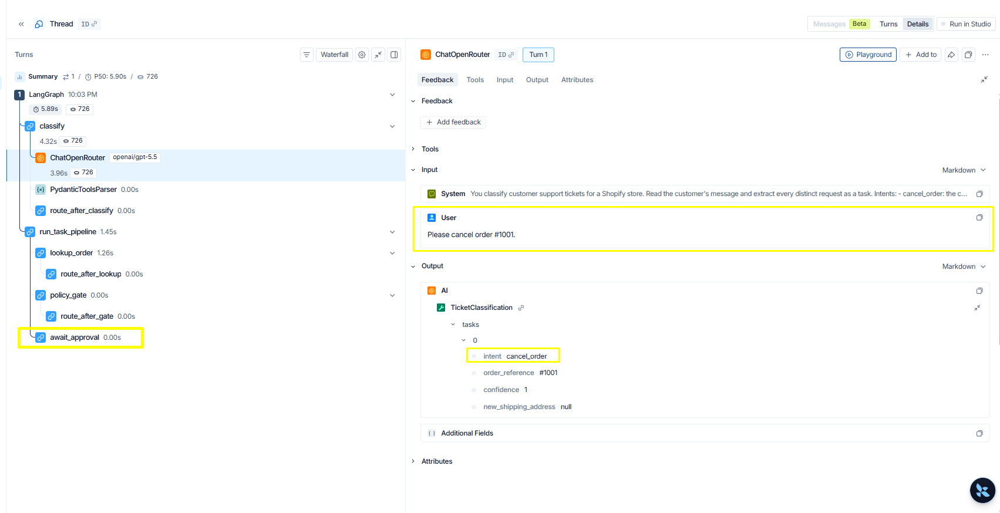
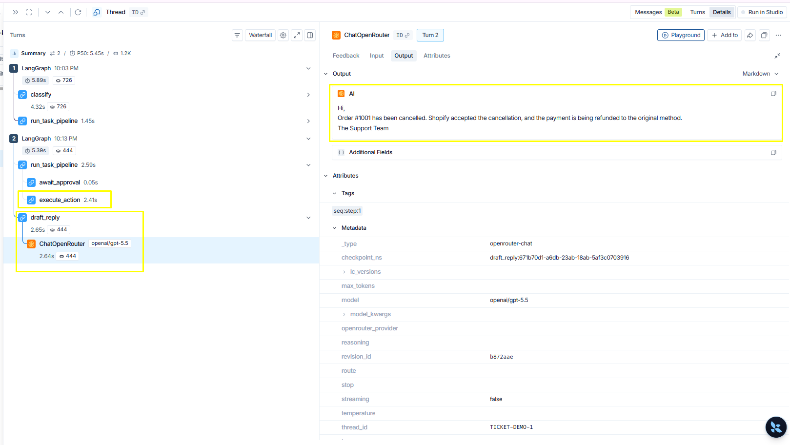
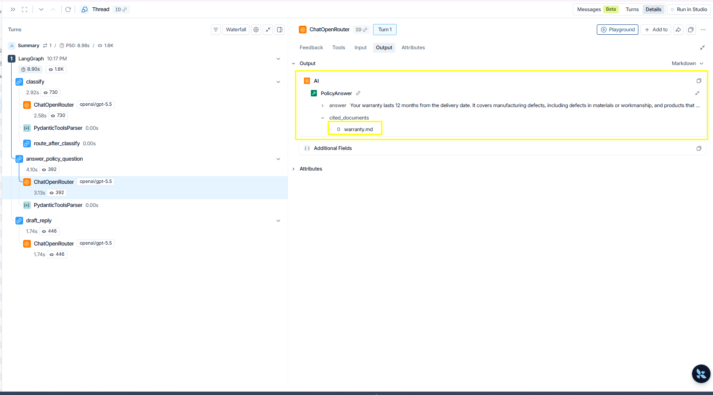

# Reading a storekeeper trace

storekeeper's core claim is that language tasks and business controls stay
separate. LangSmith traces make that visible: every run shows exactly where a
model was involved and where it was not.

## Enable tracing

Set these in `.env` (see `.env.example`):

```text
LANGSMITH_API_KEY=...
LANGSMITH_TRACING=true
LANGSMITH_PROJECT=storekeeper
```

Tracing sends run content (ticket text, order data, drafted replies) to
LangSmith. Leave it off if that data should stay on your machine.

Every `run_ticket.py` invocation then appears in the LangSmith project. The
**Threads** view groups runs by ticket id, because the graph uses the ticket
id as its checkpoint `thread_id`.

## A write request stops at the approval

Run a cancellation ticket and open its trace:

```powershell
uv run python scripts/run_ticket.py TICKET-DEMO-1 "Please cancel order #1001."
```



Three things to notice:

- `classify` holds the run's only model call. The customer's text goes in and
  a typed task comes out (`intent`, `order_reference`, `confidence`). The
  `requested_action` is derived in code from the intent, so the model cannot
  pick an action that does not match what it classified.
- `lookup_order` and `policy_gate` finish in 0.00s and have no model calls
  under them. The policy decision is plain Python; ticket text cannot argue
  with it.
- The tree ends at `await_approval`. There is no execute node anywhere in
  this trace — the write is structurally unreachable until a human decides.

## The write exists only after a human decision

Approve the pending action:

```powershell
uv run python scripts/run_ticket.py TICKET-DEMO-1 --approve INTERRUPT_ID
```



- The approval creates **Turn 2** on the same thread. The gap between the two
  turns is the human decision — it can be minutes, hours, or a process
  restart apart, because the pending state lives in SQLite checkpoints.
- `execute_action` appears for the first time. The Shopify write exists only
  in the post-approval trace.
- `draft_reply` makes the pipeline's second model call and outputs the
  customer reply. It is a draft; nothing is sent automatically.
- The run metadata shows `thread_id: TICKET-DEMO-1` — the thread is the ticket.

## A policy question never touches the gate

```powershell
uv run python scripts/run_ticket.py TICKET-DEMO-2 "How long is your warranty and what does it cover?"
```



- The tree is `classify → validate_task_plan → process_task → draft_reply`.
  Inside `process_task`, a policy question uses the read-only answer path. There is no
  task pipeline at all: no order lookup, no gate, no approval — nothing to
  approve, because nothing writes.
- Open the policy-answer model call inside `process_task` and check its **Input**
  tab: the prompt contains the policy chunks retrieved from the local Chroma
  index, not whole policy files.
- The **Output** is a structured `PolicyAnswer` whose `cited_documents` name
  the sources used. Code verifies the citations afterwards and drops any
  document the model names but was never actually given.

## A multi-request ticket fans out

For v2 traces, open a ticket with independent requests. After
`validate_task_plan`, LangGraph creates one `process_task` branch per classified
task through `Send`. Several `await_approval` nodes may pause in the same turn.
Each resume addresses one interrupt id; `draft_reply` appears only after every
branch has completed, then composes the ordered results once.
